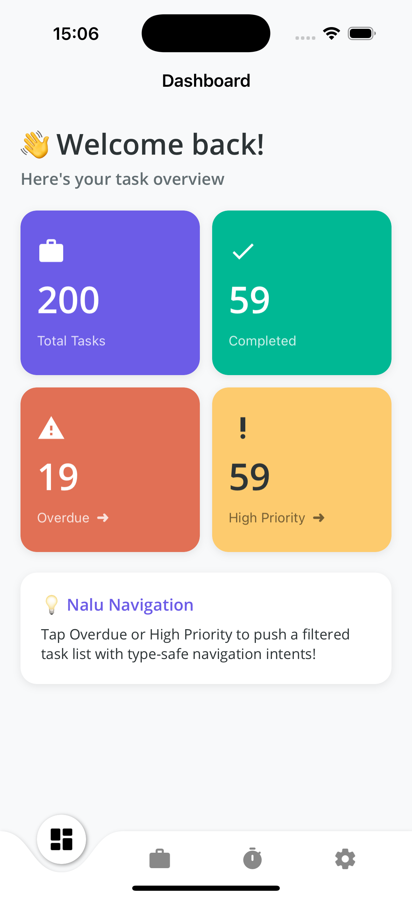
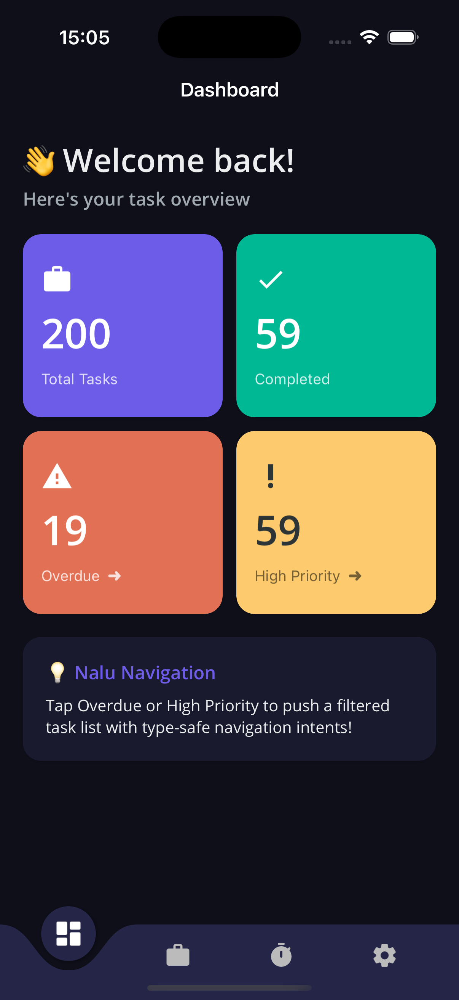

# TaskFlow — A Nalu.Maui Demo App

A polished .NET MAUI task manager built to showcase the features of [**Nalu.Maui**](https://github.com/nalu-development/nalu) — a powerful library for navigation, layouts, and controls in .NET MAUI.

Built as a companion app for a video walkthrough of Nalu's capabilities.

<p align="center">
  
  &nbsp;&nbsp;
  
</p>

## Nalu Features Demonstrated

| Feature | Where in the App |
|---------|-----------------|
| **Type-safe Navigation** | Dashboard → filtered task list with `WithIntent(filter)` |
| **`IEnteringAware<T>`** | Task editor receives task ID; task list receives filter |
| **`ILeavingGuard`** | Edit a task, tap back → "Unsaved Changes" popup |
| **`IAppearingAware`** | Dashboard stats refresh on every visit |
| **`VirtualScroll`** | 200-item task list with smooth scrolling & pull-to-refresh |
| **`ExpanderViewBox`** | Tap a task row to reveal details + edit button |
| **`ToggleTemplate`** | Time Log: Recent/Summary view swap · Settings: Light/Dark mode label swap |
| **`HorizontalWrapLayout`** | Settings tag chips that flow and wrap naturally |
| **`DurationWheel`** | Time Log duration picker |
| **`ViewBox`** | Lightweight containers throughout |
| **Custom `NaluTabBar`** | Animated curved tab bar with floating icon |
| **Dark Mode** | Full `AppThemeBinding` theming with live toggle |

## Getting Started

### Prerequisites

- .NET 10 SDK
- Visual Studio 2022 17.14+ or VS Code with .NET MAUI extension
- Xcode 16+ (for iOS) or Android SDK

### Run it

```bash
# iOS Simulator
dotnet build src/Nalu.Maui.TaskFlow -f net10.0-ios -r iossimulator-arm64
xcrun simctl install booted src/Nalu.Maui.TaskFlow/bin/Debug/net10.0-ios/iossimulator-arm64/Nalu.Maui.TaskFlow.app
xcrun simctl launch booted com.nalu.maui.taskflow

# Android
dotnet build src/Nalu.Maui.TaskFlow -f net10.0-android -t:Run
```

## NuGet Packages Used

| Package | Version |
|---------|---------|
| [Nalu.Maui](https://www.nuget.org/packages/Nalu.Maui) | 10.7.5 |
| [Nalu.Maui.VirtualScroll](https://www.nuget.org/packages/Nalu.Maui.VirtualScroll) | 10.7.5 |
| [CommunityToolkit.Maui](https://www.nuget.org/packages/CommunityToolkit.Maui) | 13.0.0 |
| [CommunityToolkit.Mvvm](https://www.nuget.org/packages/CommunityToolkit.Mvvm) | 8.4.0 |

## App Structure

```
├── MauiNaluSample.slnx     # Solution file
├── src/Nalu.Maui.TaskFlow/
│   ├── PageModels/          # ViewModels (MVVM with CommunityToolkit)
│   ├── Pages/               # XAML views
│   ├── Models/              # TaskItem, TimeEntry, TaskListFilter
│   ├── Services/            # TaskService (in-memory data)
│   ├── Popups/              # Discard changes confirmation
│   ├── AppShellTabBar.*     # Custom animated tab bar
│   ├── FancyTabBarShape.cs  # Curved inset path for tab bar
│   └── MauiProgram.cs       # Nalu + service registration
└── docs/                    # Screenshots
```

## Credits

- [**Nalu.Maui**](https://github.com/nalu-development/nalu) by [@albyrock87](https://github.com/albyrock87)
- Demo app by [@jfversluis](https://github.com/jfversluis)

## License

This demo app is provided as-is for educational purposes. See the [Nalu repository](https://github.com/nalu-development/nalu) for library licensing.
